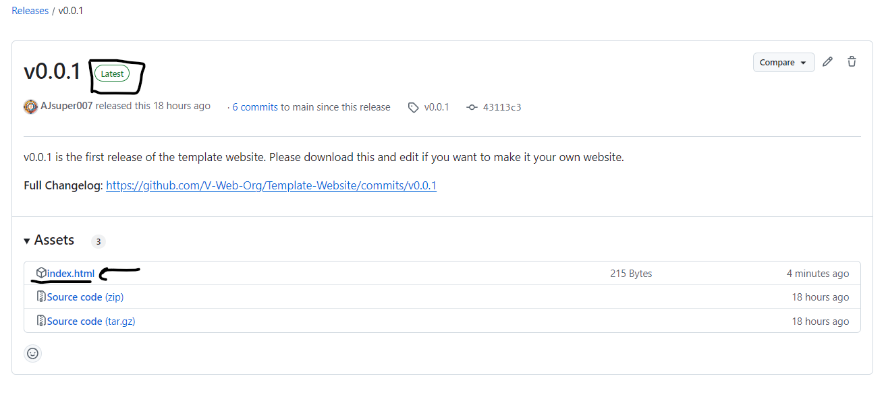
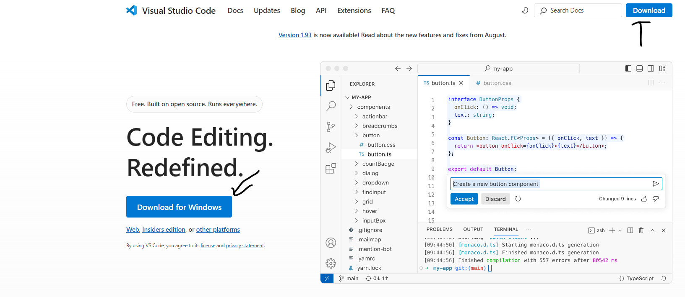
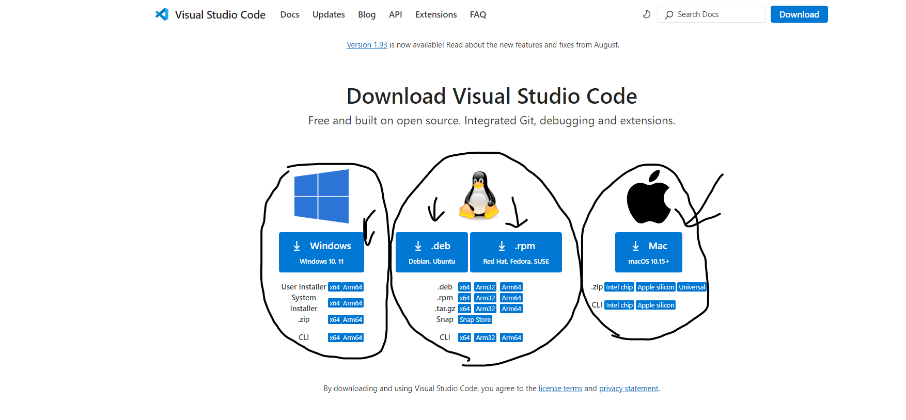

# Template-Website Set-up

# Go to releases and download the latest release.

# Download only the index.html file

# Open the files in VS Code or and other code editor and edit them.
VS Code download links:https://code.visualstudio.com   https://code.visualstudio.com/download

