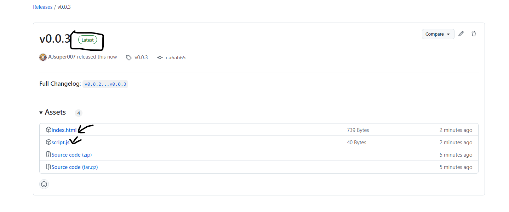
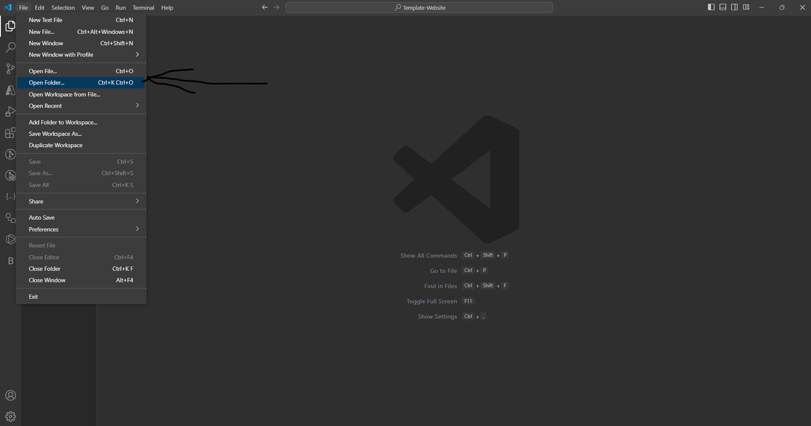

# Template-Website Set-up

# Go to releases

# Download only the index.html and script.js files

# Download VS Code
VS Code download links: [VS Code Web](https://code.visualstudio.com)  [VS Code Download](https://code.visualstudio.com/download)

# Launch VS Code and go to files, open folder, create a new folder and open it. Then move the files to that folder. If you are stuck on this step, use tutorials on [Youtube](https://www.youtube.com/).

